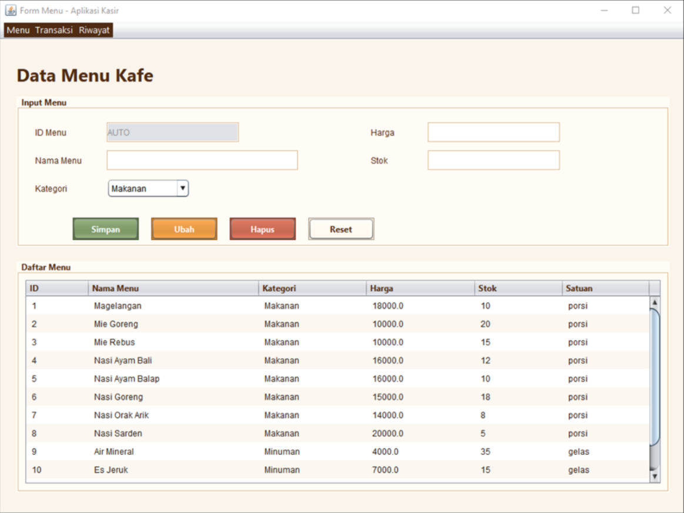
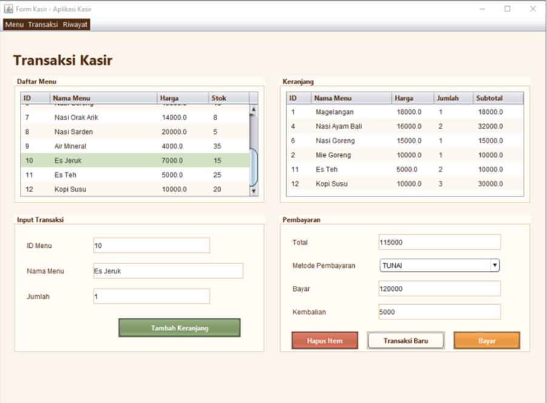
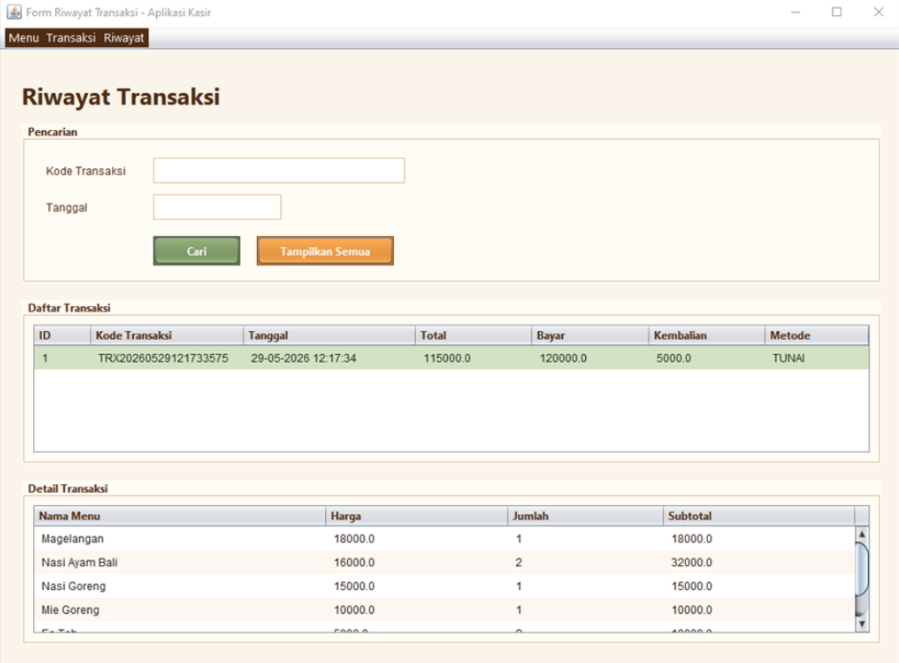

# Aplikasi Kasir Kafe

Aplikasi Kasir Kafe adalah aplikasi desktop Java Swing untuk mengelola menu kafe, memproses transaksi kasir, dan melihat riwayat transaksi. Proyek ini dibuat dengan pola pemisahan tanggung jawab antara `model`, `dao`, `service`, `controller`, `view`, dan `util`, sehingga logika bisnis tidak langsung bercampur dengan tampilan.

## Tampilan Aplikasi

> Simpan tiga screenshot aplikasi pada folder `docs/screenshots` dengan nama file sesuai path di bawah agar gambar tampil di README.

### Form Menu



### Form Transaksi Kasir



### Form Riwayat Transaksi



## Fitur Utama

- Mengelola data menu makanan dan minuman.
- Menambah, mengubah, menghapus, dan mereset input menu.
- Menampilkan daftar menu lengkap dengan kategori, harga, stok, dan satuan.
- Memilih menu dari tabel untuk dimasukkan ke keranjang transaksi.
- Menambah item ke keranjang dan menghitung subtotal otomatis.
- Menghapus item keranjang atau memulai transaksi baru.
- Mendukung metode pembayaran `TUNAI`, `TRANSFER`, dan `QRIS`.
- Menghitung kembalian otomatis untuk pembayaran tunai.
- Menyimpan transaksi beserta detail pembeliannya ke database.
- Mengurangi stok menu setelah transaksi berhasil.
- Melihat semua riwayat transaksi.
- Mencari transaksi berdasarkan kode transaksi atau tanggal.
- Menampilkan detail item dari transaksi yang dipilih.

## Struktur Proyek

```text
src/com/kasirapp
+-- controller  # Penghubung antara view dan service
+-- dao         # Query SQL dan koneksi database
+-- main        # Entry point sederhana untuk cek koneksi database
+-- model       # Entity dan konsep objek aplikasi
+-- service     # Validasi dan logika bisnis
+-- util        # Helper format, validasi, dan kode transaksi
+-- view        # JFrame Swing untuk menu, kasir, dan riwayat
```

## Alur Aplikasi

1. `FormMenu` digunakan untuk mengelola menu kafe. Data menu disimpan pada tabel `menu`.
2. `FormKasir` mengambil daftar menu dari database, lalu kasir dapat menambahkan item ke keranjang.
3. Saat pembayaran diproses, `KasirService` membuat transaksi dan memanggil `TransaksiService`.
4. `TransaksiService` menyimpan data ke tabel `transaksi` dan `detail_transaksi` dalam satu transaksi database.
5. Stok menu dikurangi setelah detail transaksi berhasil tersimpan.
6. `FormRiwayatTransaksi` menampilkan transaksi yang sudah tersimpan dan detail itemnya.

## Konsep PBO yang Digunakan

- **Encapsulation**: atribut model dibuat `private` atau `protected` dan diakses melalui getter/setter.
- **Inheritance**: `Makanan` dan `Minuman` mewarisi abstract class `MenuItem`.
- **Abstraction**: `MenuItem` mendefinisikan method abstract `getJenisMenu()` dan `getSatuan()`.
- **Polymorphism**: daftar menu bertipe `List<MenuItem>` dapat berisi objek `Makanan` atau `Minuman`.
- **Composition**: `Transaksi` menyimpan kumpulan `DetailTransaksi`, sedangkan `KeranjangItem` menyimpan `MenuItem`.
- **Modularization**: `view`, `controller`, `service`, dan `dao` dipisahkan agar kode lebih mudah dipelihara dan diskalakan.

## Database

Database yang digunakan adalah MySQL dengan nama `kasir_kafe`. Struktur tabel tersedia di:

```text
database/schema.sql
```

Tabel utama:

- `menu`: menyimpan data menu makanan dan minuman.
- `transaksi`: menyimpan data pembayaran.
- `detail_transaksi`: menyimpan rincian item pada setiap transaksi.

Konfigurasi koneksi ada di:

```text
src/com/kasirapp/dao/DatabaseConnection.java
```

Konfigurasi default:

```java
public static final String URL = "jdbc:mysql://localhost:3306/kasir_kafe";
public static final String SERVER_URL = "jdbc:mysql://localhost:3306";
public static final String USER = "root";
public static final String PASSWORD = "";
```

Jika password MySQL berbeda, ubah nilai `PASSWORD`. Jika password kosong, gunakan `""`.

## Cara Menjalankan

1. Pastikan Java, NetBeans, dan MySQL sudah terpasang.
2. Pastikan driver MySQL tersedia. Proyek ini sudah menyertakan:

```text
dist/lib/mysql-connector-j-8.0.33.jar
```

3. Jalankan MySQL.
4. Buat database dengan menjalankan:

```bash
mysql -u root -p < database/schema.sql
```

5. Buka proyek di NetBeans.
6. Jalankan salah satu form berikut dari package `com.kasirapp.view`:

```text
FormMenu.java
FormKasir.java
FormRiwayatTransaksi.java
```

Catatan: `MainApp.java` hanya melakukan pengecekan koneksi database dan tidak membuka GUI utama.

## Format Pencarian Riwayat

Pada `FormRiwayatTransaksi`, pencarian tanggal menggunakan format:

```text
dd-MM-yyyy
```

Contoh:

```text
29-05-2026
```

## Catatan Pengembangan

- `MenuDAO` memakai `PreparedStatement` untuk operasi database menu.
- `TransaksiService` memakai `setAutoCommit(false)`, `commit()`, dan `rollback()` agar penyimpanan transaksi dan pengurangan stok berjalan atomik.
- `KasirService` menyimpan keranjang sementara dalam `List<KeranjangItem>`.
- Validasi input dasar diletakkan di `ValidationUtil`.
- Kode transaksi dibuat otomatis oleh `KodeTransaksiUtil`.
